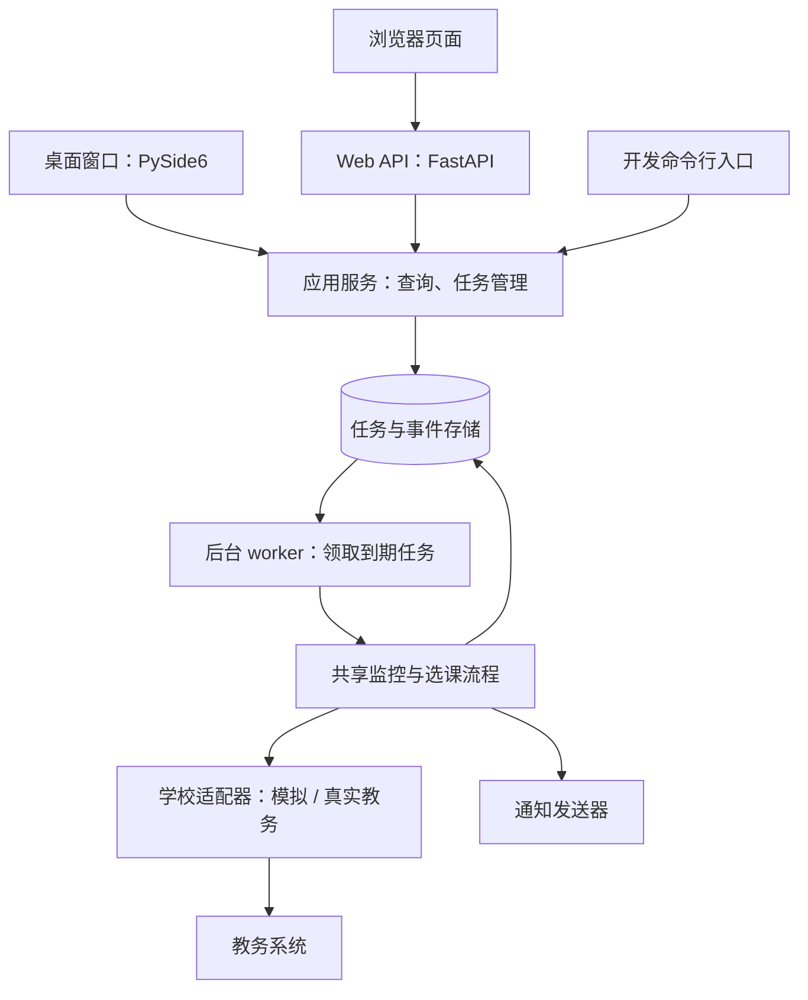

# 课来：架构设计 v0.1

日期：2026-10-03。状态：开发基线；接口细节随真实教务调查调整。

## 1. 产品目标与开发顺序

用户通过项目学习模块设计、接口、存储、并发、界面、测试与发布。AI 承担架构设计，用户在指导下实现业务功能。

最终提供两种入口：
- 桌面版：本机登录教务系统、本机监控、通知；用户电脑必须持续运行。
- 网页版：浏览器管理任务，服务器 worker 持续执行；关闭网页仍能监控。服务器是否能访问学校系统、如何获得合法的用户登录会话，必须先验证。

先完成模拟核心和真实只读接入，再做桌面版与选课验收，然后扩展 Web。多用户部署到后续阶段，不在当前同时实现两套界面。

## 2. 整体流程



这是代码职责图，不表示桌面和服务器共用一个进程。桌面运行自己的应用服务和后台执行线程；服务器运行 API 进程和独立 worker 进程，各自部署同一份核心代码。桌面版默认连接本机教务会话，并非强制依赖云端。

## 3. 模块边界

### domain：统一的数据与业务含义
包含 Course、CourseStatus、WatchTask、EnrollmentResult，以及可区分的业务错误。
- Course：学校 ID、学期、教学班 ID、课程名、教师等稳定信息。
- CourseStatus：容量、已选人数、余量、查询时间、可选状态。
- WatchTask：任务 ID、owner_id、教务账号引用、教学班引用、通知/自动选课模式、任务状态、下一次检查时间。
- EnrollmentResult：成功、已选、满员、会话失效、规则拒绝、结果未知。

课程名可重复，必须按学校、学期、教学班定位。接口缺字段或数据异常时记录“状态未知”，不能推断有空位。

### adapters：教务系统与通知的接入
学校适配器将各校返回的数据转换为统一模型。首期使用明确标注的模拟适配器；真实适配器基于实际接口证据实现。
概念接口：list_courses、get_course_status、list_enrolled_courses、enroll。登录/验证码流程在调查后确定，不预设所有学校都有同一种 login 方法。
通知适配器提供 send(event)。先用控制台通知，再接桌面通知和选定的网页通知渠道。

### application：业务流程
- CourseCatalogService：调用适配器、转换结果，提供课程查询。
- TaskService：创建、取消、读取任务，检查模式、归属和重复任务。
- MonitorService：执行一次检查，决定继续等待、通知、提交或暂停。
- EnrollmentService：检查当前已选状态、处理提交结果和不确定结果。

监控流程不负责自己启动无限循环，也不负责画窗口。它处理“一次检查”，便于测试和复用。

### worker：任务调度与持续执行
重复执行：读取到期任务 → 领取任务 → 调用 MonitorService → 保存结果和下次检查时间。
- 首期单实例执行，避免并发提交；网页阶段将它放到独立进程。
- 等待可中断，网络请求有超时；取消任务须在发起选课前再次检查。
- 后续增加 worker 实例时，用数据库原子领取和租约；不能靠进程内变量去重。
- 同一用户、同一教学班避免并行提交；不同账号的登录会话独立。
- 桌面线程只通过消息/信号通知主线程更新界面，不直接操作控件。

### storage：任务与运行记录
本机先使用 SQLite，保存任务、状态变化和待发送通知。查询快照可按需保留，日志不保存凭据。
数据库操作封装在少量具体仓储类中，不提前写通用 ORM 框架。
公开 Web 阶段评估 PostgreSQL，支持 API 与 worker 并发、归属查询和事务领取；迁移必须保留任务与事件。

### interfaces：用户操作入口
- cli：开发与联调，输入课程筛选条件，输出课程和任务结果。
- desktop：课程列表、监控任务、开始/停止、登录状态、结果与运行日志。
- web：API、网站认证、页面资源与用户操作。API 调用应用服务，页面不直接操作学校 Cookie。

## 4. 目标目录

以下为逐阶段创建的目标结构；当前只有项目包入口与文档，不代表模块已实现。

```text
02_kelai/
├─ .venv/                         本机环境，排除版本管理
├─ AGENTS.md                      AI 协作规则
├─ README.md                      项目入口
├─ pyproject.toml                 包配置、依赖与测试配置
├─ docs/
│  ├─ ARCHITECTURE.md              架构决策与职责
│  ├─ DEVELOPMENT.md               阶段计划与当前任务
│  ├─ VALIDATION.md                验收标准与证据
│  └─ HANDOFF.md                   进度、待办和未验证项
├─ src/kelai/
│  ├─ __init__.py
│  ├─ domain/models.py             课程、任务、结果模型
│  ├─ adapters/
│  │  ├─ school.py                 学校接口约定
│  │  ├─ mock_school.py            可控制的模拟教务系统
│  │  ├─ hzcu.py                   学校适配，确认学校与接口后实现
│  │  └─ notifications.py          通知接入
│  ├─ application/
│  │  ├─ catalog.py                课程查询
│  │  ├─ tasks.py                  任务创建/取消/查询
│  │  ├─ monitoring.py             一次监控检查
│  │  └─ enrollment.py             提交与结果核验
│  ├─ storage/
│  │  ├─ sqlite.py                 本机连接与迁移
│  │  └─ repositories.py           任务、事件和通知持久化
│  ├─ worker.py                    后台执行入口
│  ├─ bootstrap.py                 选择适配器，组装服务和配置
│  └─ interfaces/
│     ├─ cli.py                    开发入口
│     ├─ desktop/                  桌面窗口与后台桥接
│     └─ web/                      API 路由、认证、页面与静态资源
├─ tests/
│  ├─ unit/                        关键决策与异常分类
│  ├─ integration/                 适配器/数据库组合
│  └─ acceptance/                  模拟完整业务链路
├─ scripts/                        检查、启动和打包入口
└─ data/                           本机开发运行数据，排除版本管理
```

安装后的桌面运行数据放在用户应用数据目录，不写入安装目录。上面的 data/ 仅用于开发，实际数据路径由配置决定。

依赖方向：入口 → 应用服务 → 数据模型和接入约定；真实网络、数据库和通知由组装入口注入。核心不导入 GUI、FastAPI 或前端代码。新增抽象以模拟与真实接入的共同需求为依据。

## 5. 状态与重复选课处理

主要状态：WAITING、CHECKING、ENROLLING、SUCCEEDED、CANCELLED、NEEDS_LOGIN、NEEDS_REVIEW、FAILED。
- 满员：继续 WAITING，安排下次检查。
- 有余量且仅通知：保存余量变化事件，回到 WAITING；重复相同状态不重复通知。
- 有余量且允许自动选课：再次检查任务未取消且未已选，再进入 ENROLLING。
- 已选或核验成功：SUCCEEDED，停止该任务的选课动作并生成通知事件。
- 会话失效：NEEDS_LOGIN，等待用户重新登录。
- 临时断网或限频：保存原因和下次检查时间，退避重试。
- 明确的时间冲突或资格拒绝：FAILED，记录可理解的原因。
- POST 超时/连接中断：查询已选列表；不能确认时进入 NEEDS_REVIEW，禁止直接重发选课。

进程在提交后崩溃时，也必须先核验已选结果。不能承诺外部教务接口“恰好执行一次”；我们用任务领取、提交前检查和不确定结果核验降低重复提交风险。

任务状态与通知事件一起持久化。通知失败只重试通知，不能重新选课。通知使用事件 ID 去重并记录发送状态。

## 6. 网页如何持续工作

浏览器请求创建任务 → API 校验用户并保存任务 → 返回任务 ID → 独立 worker 执行 → 数据库保存状态 → 页面查询结果/通知渠道发送消息。

页面关闭不影响 worker。API 进程重启也不应删除任务。worker 重启从数据库恢复，对 ENROLLING 等不确定状态先核验，不直接重复提交。首期只运行一个 worker；后续扩容须先验证租约到期恢复。

FastAPI BackgroundTasks 是请求返回后的附加任务机制，本项目不把长期监控循环放在其中。独立 worker、持久化状态和进程管理是本项目为持续监控作出的设计选择。

网站账号与教务账号不同。所有任务查询、修改、取消和通知配置都由服务器按当前网站身份限定 owner_id，不能相信浏览器提交的用户 ID。

公网服务器能访问学校系统、认证机制能支持服务器代执行，才推进真实云端监控；单靠部署网页无法解决这两项。若不满足，保留本机监控，评估校园内在线设备或学校允许的其他接入方式，并明确产品边界。

## 7. 技术选择与引入时机

- Python 3.13：当前环境已验证；后续依赖在此环境实际安装后锁定版本。
- pytest：核心业务开始时安装，验证真实的输入输出和失败场景。
- SQLite：任务持久化阶段引入，Python 内置接口即可起步。
- PySide6：桌面阶段引入，界面与后台业务分离。
- FastAPI：网页阶段引入，提供任务和状态 API。
- HTML/CSS/JavaScript：初期网页使用服务端提供的页面和少量交互，前后端同源部署。
- HTTP 客户端 / Playwright：真实教务调查后选择；需要浏览器登录时使用浏览器，不猜接口或绕过验证码。
- PostgreSQL：公开多用户 Web 阶段评估与验证，当前不安装。

先做一个模块化项目，不拆微服务。数据库、调度器和前端框架的选择随实际规模调整。

## 8. 官方参考

- [Python 包与 src 目录](https://packaging.python.org/en/latest/tutorials/packaging-projects/)
- [Qt for Python 环境与安装](https://doc.qt.io/qtforpython-6/gettingstarted.html)
- [FastAPI 多文件应用](https://fastapi.tiangolo.com/tutorial/bigger-applications/)
- [FastAPI 请求后后台任务的含义](https://fastapi.tiangolo.com/tutorial/background-tasks/)
- [Python SQLite 接口](https://docs.python.org/3/library/sqlite3.html)

上面链接支持工具用途；模块边界、执行进程和阶段计划是本项目的设计决策。
